# Inventoros

[](https://github.com/Inventoros/Inventoros/actions/workflows/tests.yml)
[](https://opensource.org/licenses/MIT)
[](https://laravel.com)
[](https://php.net)
[](https://vuejs.org)
[](https://inertiajs.com)
[](CODE_OF_CONDUCT.md)

**Inventory Management for the Rest of Us**

Inventoros is an open-source Inventory and Warehouse Management System (WMS) built with Laravel 13, Inertia.js, and Vue 3. Designed to bridge the gap between complex enterprise-grade WMS tools and user-friendly systems, Inventoros provides powerful inventory management capabilities with a developer-focused, extensible architecture.

## Screenshots

### Dark Mode

| Dashboard | Products | Orders |
|-----------|----------|--------|
| 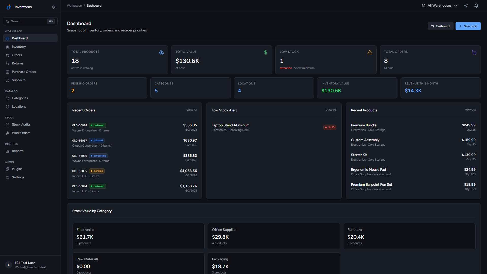 | 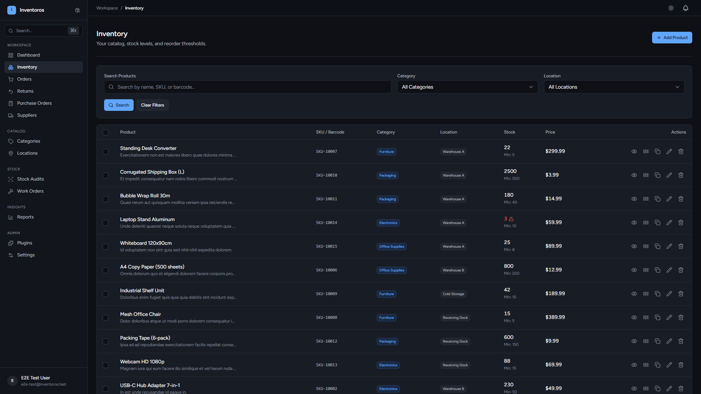 | 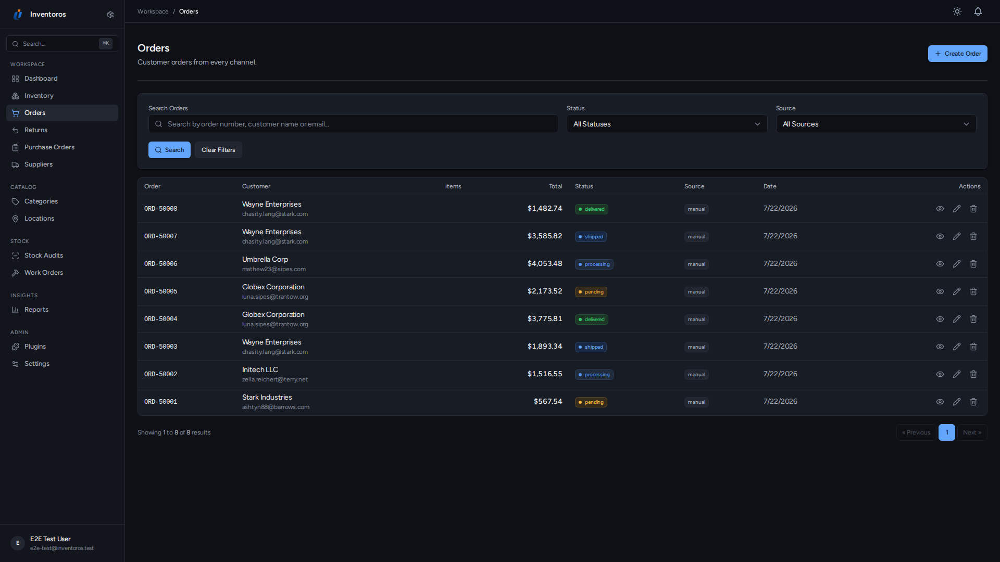 |

| Reports | Locations | Purchase Orders |
|---------|-----------|-----------------|
| 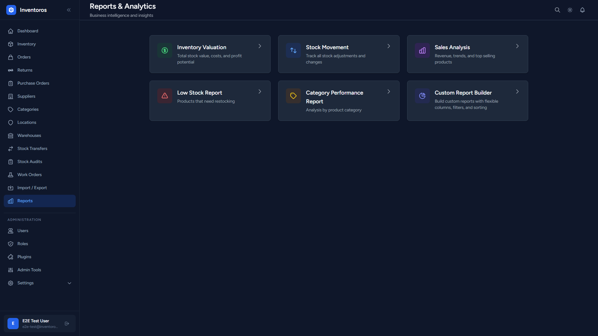 | 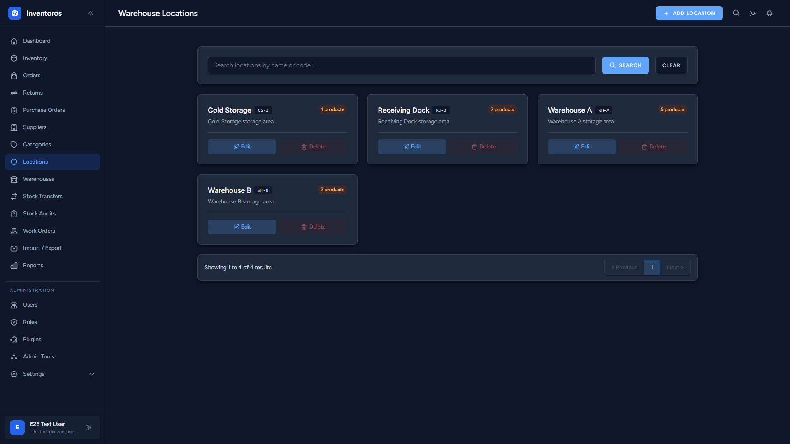 | 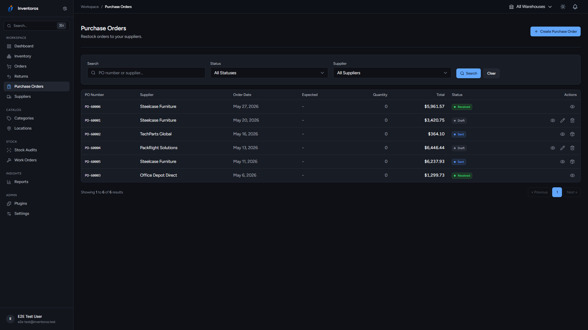 |

<details>
<summary>More dark mode screenshots</summary>

| Categories | Suppliers | Settings |
|------------|-----------|----------|
| 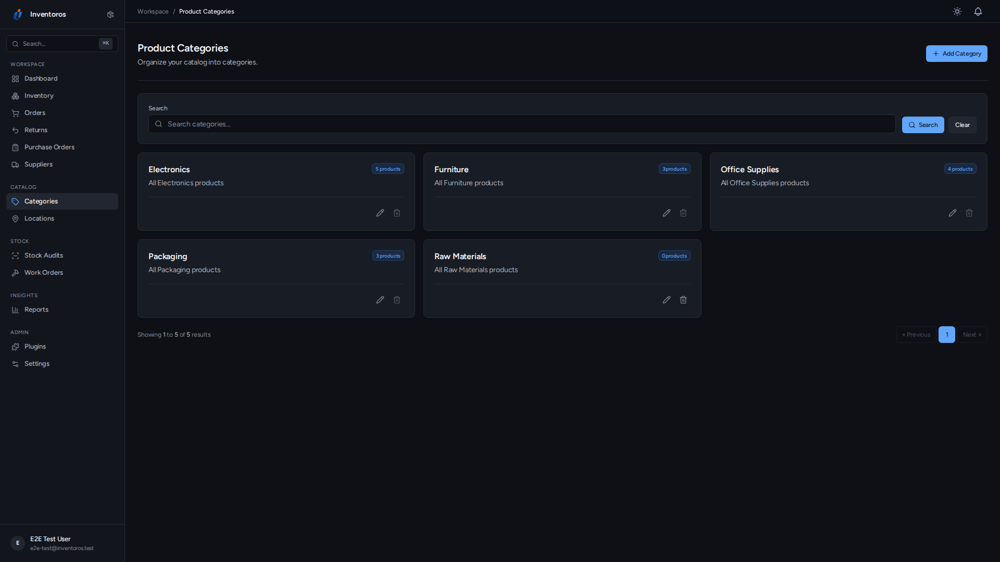 | 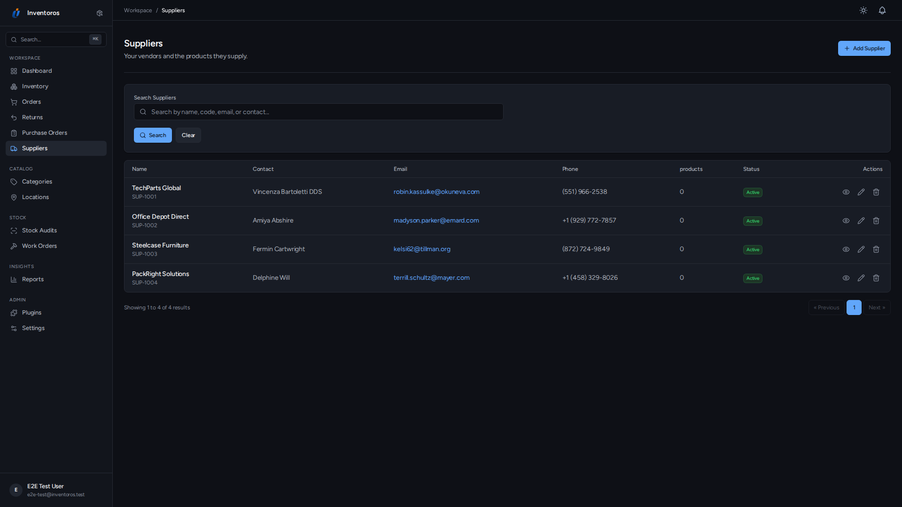 | 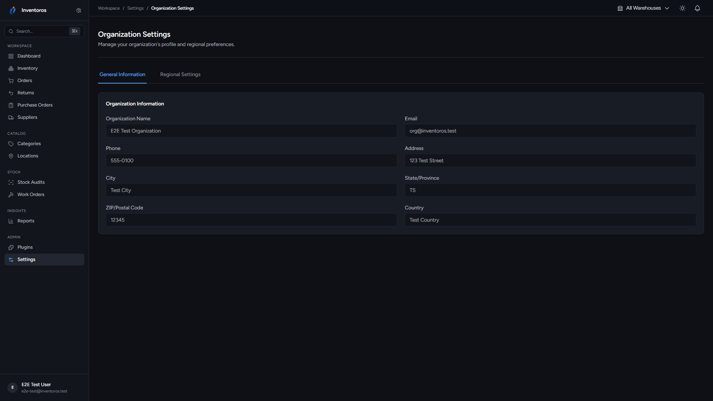 |

</details>

### Light Mode

| Dashboard | Products | Orders |
|-----------|----------|--------|
| 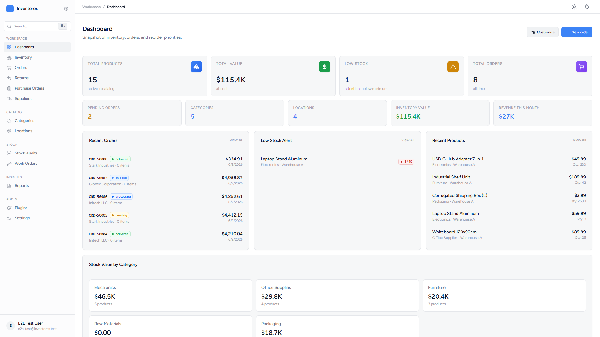 | 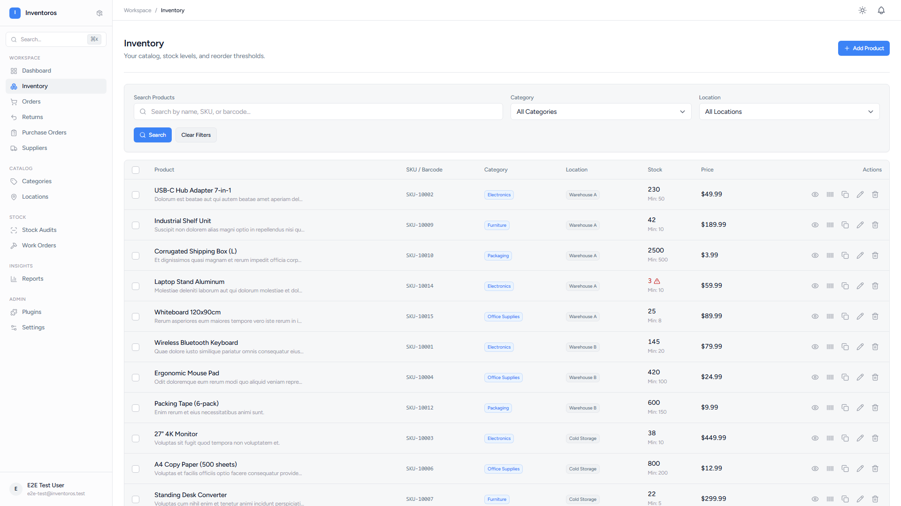 | 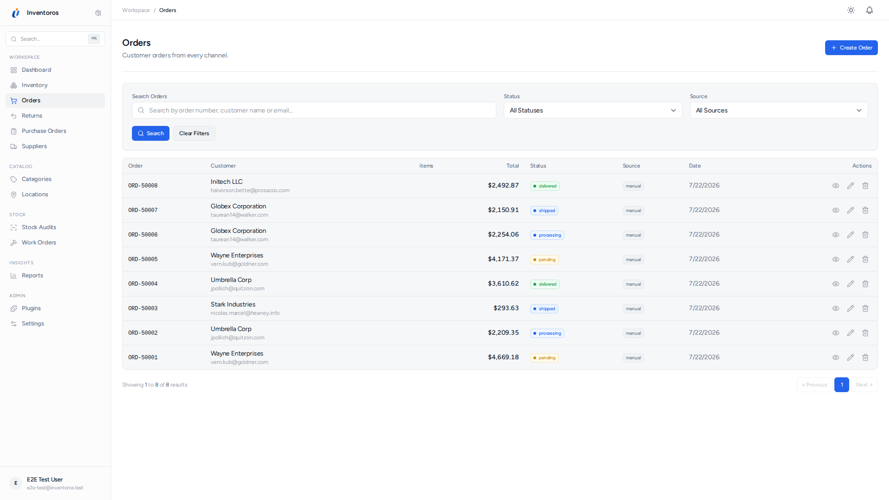 |

| Reports | Locations | Purchase Orders |
|---------|-----------|-----------------|
| 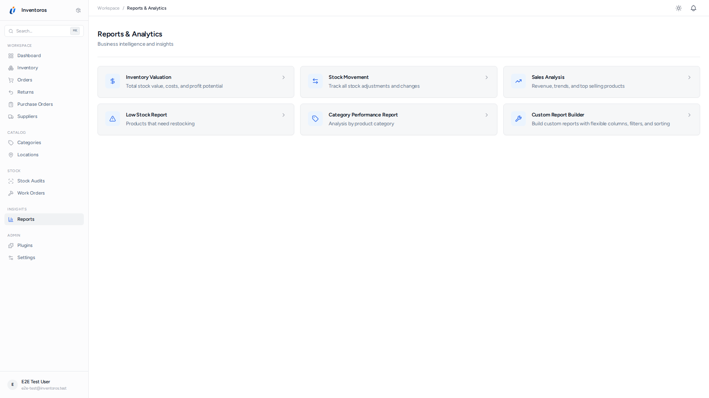 | 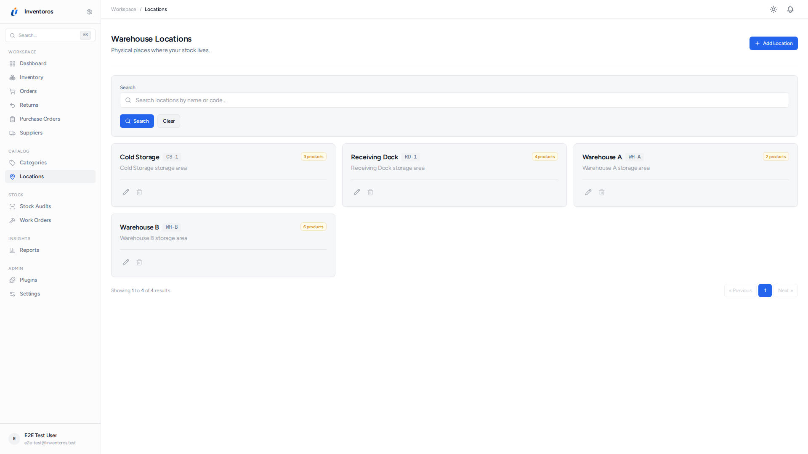 | 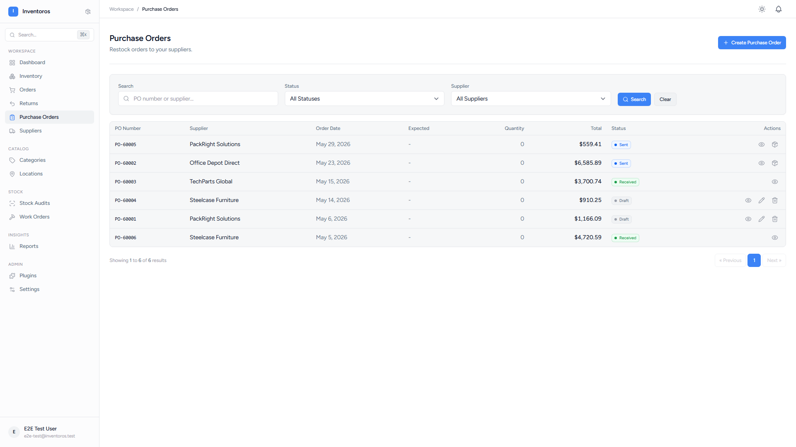 |

<details>
<summary>More light mode screenshots</summary>

| Categories | Suppliers | Settings |
|------------|-----------|----------|
| 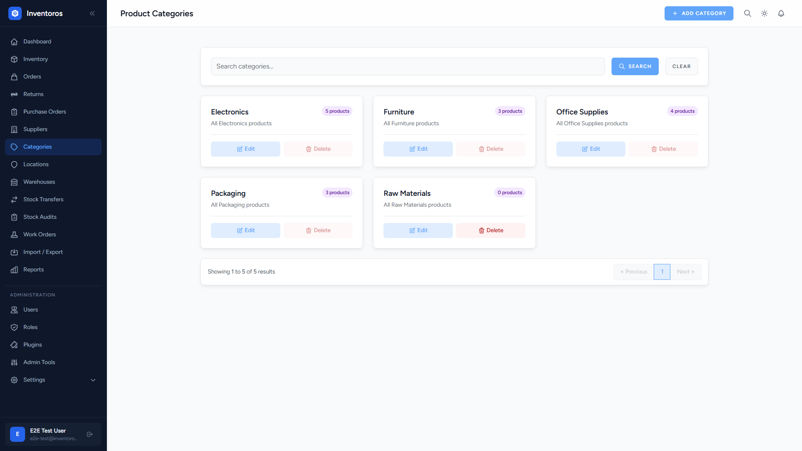 | 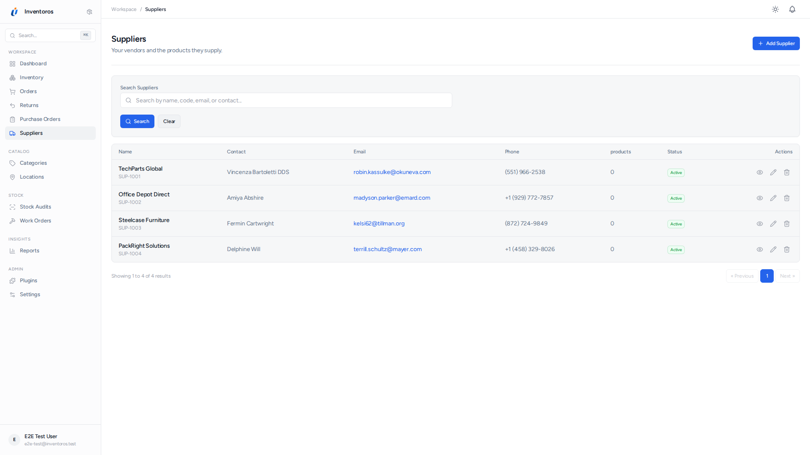 | 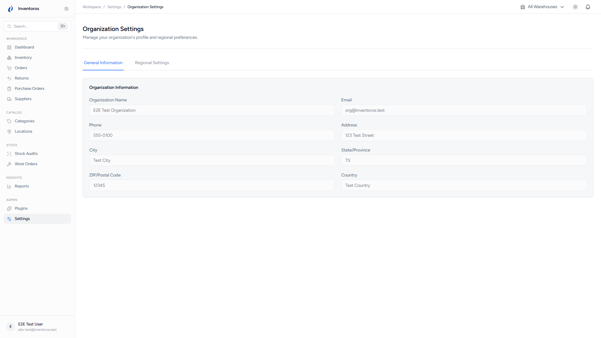 |

</details>

## Features

### Inventory & Product Management
- Full product CRUD with SKU, pricing, stock levels, categories, locations, and barcodes
- **Product variants** with options (size, color, material) and variant-specific SKUs, pricing, and stock
- **Kitting & bundling** -- create virtual kit products with auto-calculated stock from components
- **Assembly & work orders** -- production workflow that consumes components and produces finished goods
- **Batch tracking** with lot numbers, expiry dates, and manufacturing dates
- **Serial number tracking** with individual status management
- Barcode generation (UPC/EAN/Code128), bulk printing, and camera-based scanning
- Configurable SKU patterns with auto-generation
- CSV import/export for bulk operations

### Multi-Warehouse Management
- **Multiple warehouses** with addresses, contacts, and per-warehouse settings
- **Warehouse-level user access control** -- restrict staff to specific warehouses
- **Global warehouse switcher** in the header to filter all views
- **Inter-warehouse stock transfers** with shipping method, tracking number, and transit status
- Default warehouse per organization with manual override on orders
- Locations nested within warehouses (Warehouse > Aisle > Shelf > Bin)

### Order & Supply Chain
- Full order lifecycle with automatic inventory adjustments and row locking
- Order approval workflow (pending, approved, rejected)
- **Returns & exchanges (RMA)** -- full return lifecycle with automatic stock restoration
- Purchase orders with item receiving workflow and invoice generation
- Customer management with order history
- Automated reorder points with supplier-grouped PO generation

### Custom Report Builder
- **Build custom reports** from 6 data sources (products, orders, stock adjustments, customers, suppliers, purchase orders)
- Select columns, add filters (10+ operators), configure sorting
- Save reports as reusable templates, share with team
- Export reports as CSV
- Live preview while building

### User & Access Management
- Role-based access control with 30+ granular permissions
- Custom roles with reusable permission set templates
- Two-factor authentication (TOTP with setup wizard, QR code, and recovery codes)
- API token management (create, list, revoke)

### REST & GraphQL APIs
- **REST API v1** with full CRUD for all resources (products, orders, warehouses, work orders, reports, and more)
- **GraphQL API** with queries and mutations, permission checks, and query depth/complexity limits
- Auto-generated **OpenAPI 3.1 docs** via Scramble at `/docs/api`
- Sanctum token authentication

### Plugin System
- WordPress-style hooks and filters
- Extensible UI with plugin slots
- Database-driven plugin activation
- Sample plugin with documentation

### Notifications & Integrations
- Email notifications with multi-provider support (SMTP, Mailgun, SendGrid)
- Customizable templates with per-user preferences
- Webhook system with HMAC-SHA256 signing, exponential backoff retry, and delivery logs

### System & DevOps
- Multi-tenant architecture with organization-based data isolation
- Installer wizard with database validation and admin creation
- Update manager with automatic backups (UI + CLI)
- Activity logging with filtering and export
- Dark mode with persistent preferences
- Global search command palette (Ctrl+K / Cmd+K)
- Automated screenshot generation via GitHub Actions
- 1000+ tests with comprehensive coverage

## Technology Stack

| Layer | Technology |
|-------|-----------|
| Backend | Laravel 13 (PHP 8.3+) |
| Frontend | Inertia.js v3 + Vue 3 + Tailwind CSS |
| Build | Vite 7 |
| Database | SQLite (dev) / MySQL 8+ / PostgreSQL 13+ |
| API | REST + GraphQL (Sanctum auth) |
| Testing | PHPUnit + Playwright |
| Architecture | Multi-tenant, plugin-ready |

## Requirements

- PHP 8.3 or higher
- Composer 2.x
- Node.js 18+ and npm
- MySQL 8.0+ or PostgreSQL 13+ (SQLite for development)
- Redis (optional, recommended for production queues)

## Installation

### Quick Start

```bash
git clone https://github.com/Inventoros/Inventoros.git
cd Inventoros

composer install
cp .env.example .env
php artisan key:generate

php artisan migrate
npm install && npm run build

php artisan serve
```

### Development Setup

```bash
# Run all dev services (server, queue, logs, vite) concurrently
composer dev

# Or run individually
php artisan serve       # Application server
npm run dev             # Vite dev server with HMR
php artisan queue:work  # Queue worker
```

## Configuration

1. Copy `.env.example` to `.env` and configure:
   - Database credentials (`DB_*`)
   - Application URL (`APP_URL`)
   - Mail settings (for notifications)
   - Queue driver (recommend `redis` for production)

2. Run `php artisan migrate` to create the database schema

3. Run `npm run build` for production assets

## Testing

```bash
# Run all tests
composer test

# Run specific suites
php artisan test --testsuite=Feature
php artisan test --testsuite=Unit

# Run E2E tests
npm run test:e2e
```

## CLI Commands

```bash
php artisan app:update --check        # Check for updates
php artisan app:update                # Perform update with backup
php artisan app:update --backup       # Create manual backup
php artisan app:update --list-backups # List backups
php artisan app:update --restore=file # Restore from backup
```

## API

The REST API is available at `/api/v1/` with Sanctum token authentication.

<details>
<summary>View all API endpoints</summary>

| Resource | Endpoints |
|----------|-----------|
| Products | `GET`, `POST`, `GET/{id}`, `PUT/{id}`, `DELETE/{id}` |
| Product Options | Nested under products: `GET`, `POST`, `PUT/{id}`, `DELETE/{id}` |
| Product Variants | Nested under products: `GET`, `POST`, `PUT/{id}`, `DELETE/{id}`, `POST/adjust-stock` |
| Product Components | Nested under products: `GET`, `POST`, `PUT/{id}`, `DELETE/{id}` |
| Batch Tracking | Nested under products: `GET`, `POST`, `GET/{id}` |
| Serial Tracking | Nested under products: `GET`, `POST`, `GET/{id}`, `PUT/{id}` |
| Categories | `GET`, `POST`, `GET/{id}`, `PUT/{id}`, `DELETE/{id}` |
| Locations | `GET`, `POST`, `GET/{id}`, `PUT/{id}`, `DELETE/{id}` |
| Warehouses | `GET`, `POST`, `GET/{id}`, `PUT/{id}`, `DELETE/{id}` |
| Orders | `GET`, `POST`, `GET/{id}`, `PUT/{id}`, `DELETE/{id}` |
| Stock Adjustments | `GET`, `POST`, `GET/{id}` |
| Stock Audits | `GET`, `GET/{id}` |
| Suppliers | `GET`, `POST`, `GET/{id}`, `PUT/{id}`, `DELETE/{id}` |
| Purchase Orders | `GET`, `POST`, `GET/{id}`, `PUT/{id}`, `DELETE/{id}`, `POST/receive`, `POST/send`, `POST/cancel` |
| Work Orders | `GET`, `POST`, `GET/{id}`, `POST/start`, `POST/complete`, `POST/cancel` |
| Saved Reports | `GET`, `POST`, `GET/{id}`, `PUT/{id}`, `DELETE/{id}`, `GET/{id}/export` |
| Permission Sets | `GET`, `POST`, `GET/{id}`, `PUT/{id}`, `DELETE/{id}`, `GET/categories` |
| Barcode Lookup | `GET/{code}` |

</details>

The **GraphQL API** is available at `/graphql` with Sanctum bearer token authentication. Interactive API documentation is auto-generated at `/docs/api`.

## Documentation

- [Upgrade Guide](UPGRADE.md) -- Upgrading from v1.1 to v2.0
- [cPanel Deployment](CPANEL.md) -- Deploy on shared hosting
- [Plugin Development](docs/PLUGIN_DEVELOPMENT.md) -- Creating plugins with hooks and filters
- [Email Notifications](docs/features/email-notifications.md) -- Configuration and usage
- [Barcode Scanning](docs/features/barcode-scanning.md) -- Camera-based scanning integration
- [API Documentation](/docs/api) -- Interactive OpenAPI docs (available when running)

## Contributing

We welcome contributions! Please see [CONTRIBUTING.md](CONTRIBUTING.md) for guidelines.

- Follow [PSR-12](https://www.php-fig.org/psr/psr-12/) coding standards
- Use `declare(strict_types=1)` in all PHP files
- Write tests for new features
- Use conventional commit messages

## Community & Support

- [GitHub Issues](https://github.com/Inventoros/Inventoros/issues) -- Bug reports and feature requests
- [GitHub Discussions](https://github.com/Inventoros/Inventoros/discussions) -- Questions and ideas
- [Security Policy](SECURITY.md) -- Reporting vulnerabilities

## License

Inventoros is open-source software licensed under the [MIT license](LICENSE).

## Acknowledgments

Built with [Laravel](https://laravel.com), [Inertia.js](https://inertiajs.com), [Vue.js](https://vuejs.org), and [Tailwind CSS](https://tailwindcss.com).
