<p align="center">
  
</p>

<h1 align="center">Inventoros</h1>

<p align="center"><strong>Inventory Management for the Rest of Us</strong></p>

<p align="center">
  <a href="https://github.com/Inventoros/Inventoros/actions/workflows/tests.yml"></a>
  <a href="LICENSE"></a>
  <a href="https://laravel.com"></a>
  <a href="https://php.net"></a>
  <a href="https://vuejs.org"></a>
  <a href="https://inertiajs.com"></a>
  <a href="CODE_OF_CONDUCT.md"></a>
</p>

Inventoros is an open-source Inventory and Warehouse Management System (WMS) built with Laravel 13, Inertia.js, and Vue 3. Designed to bridge the gap between complex enterprise-grade WMS tools and user-friendly systems, Inventoros provides powerful inventory management capabilities with a developer-focused, extensible architecture.

## Screenshots

### Dark Mode

| Dashboard | Products | Orders |
|-----------|----------|--------|
| 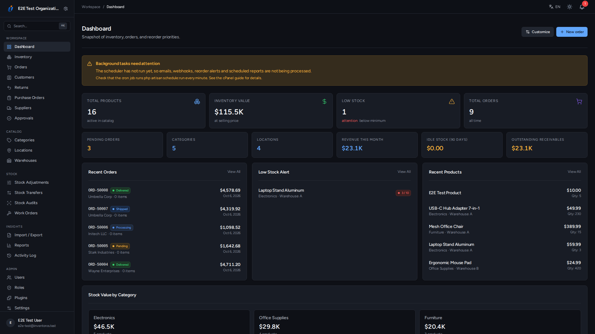 | 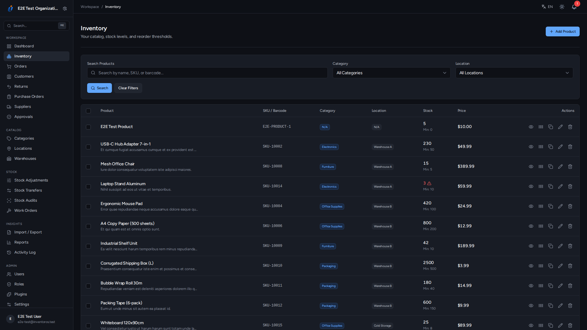 | 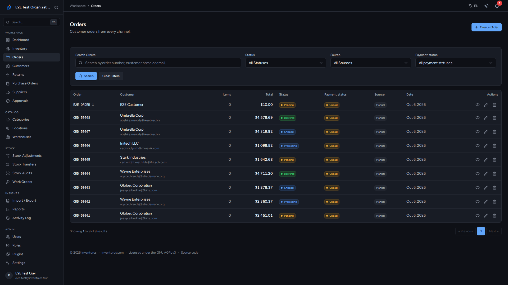 |

| Reports | Locations | Purchase Orders |
|---------|-----------|-----------------|
| 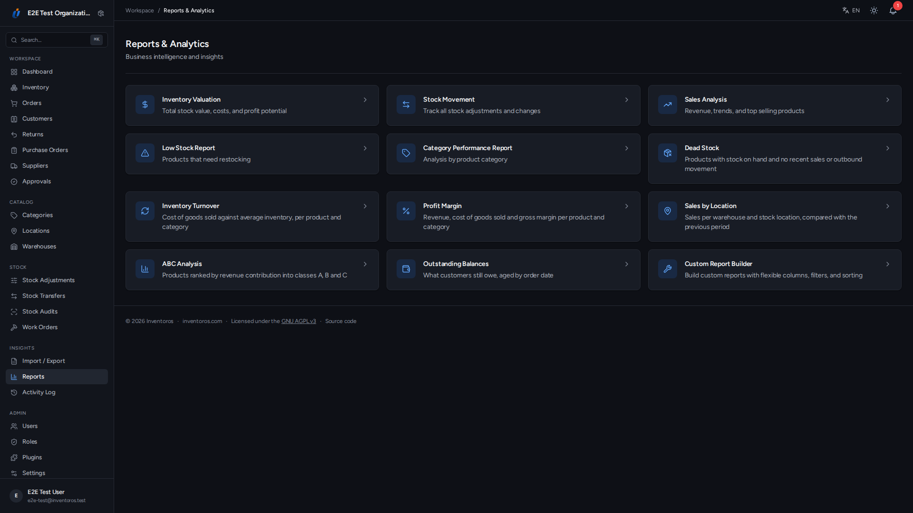 | 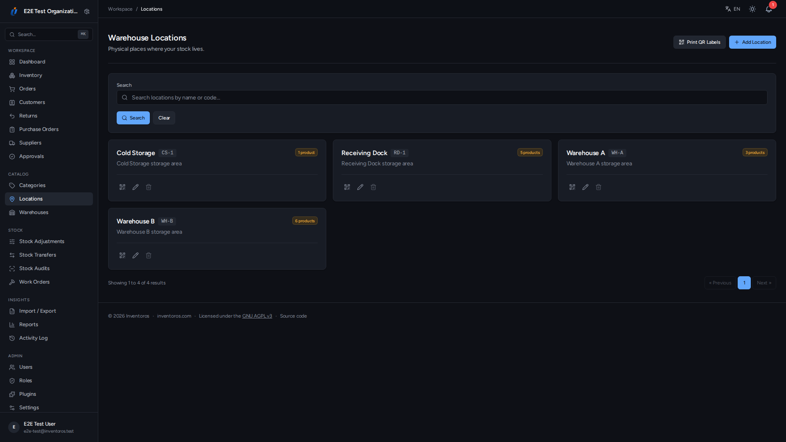 | 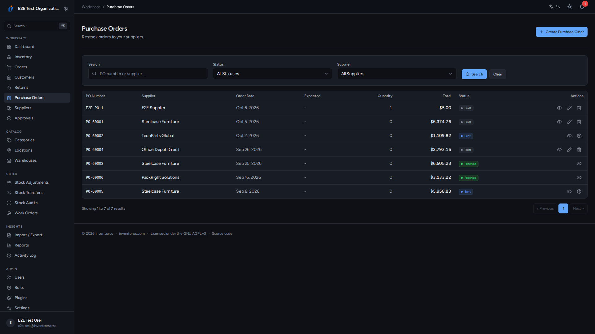 |

<details>
<summary>More dark mode screenshots</summary>

| Categories | Suppliers | Settings |
|------------|-----------|----------|
| 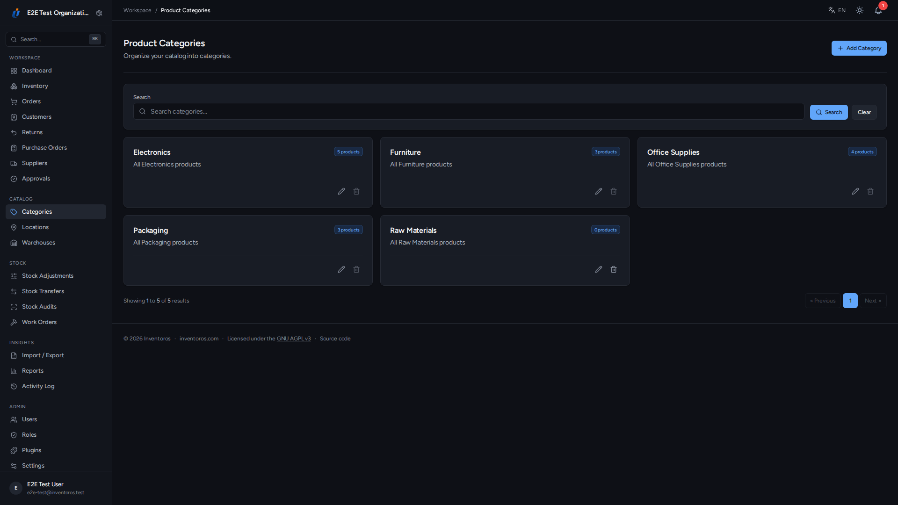 | 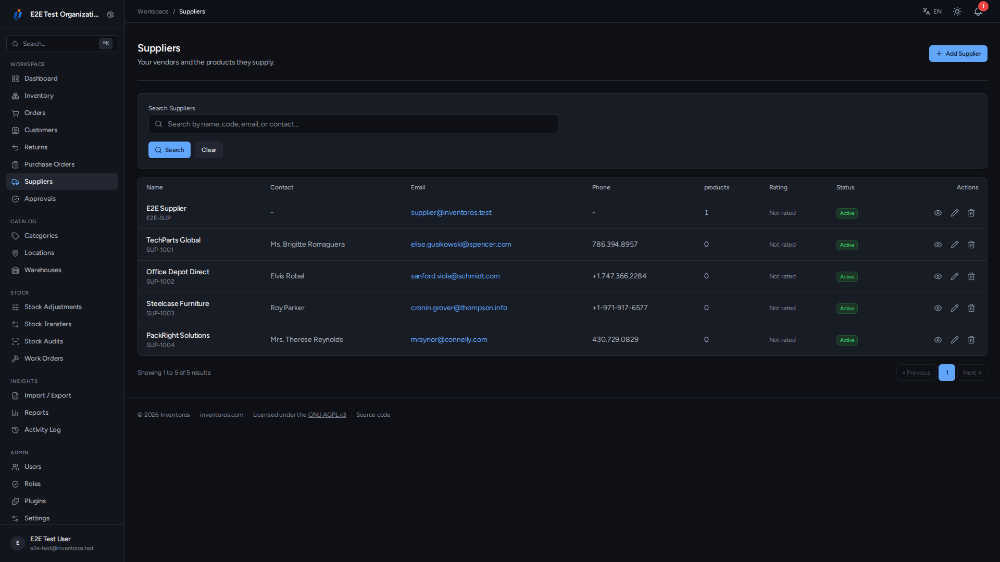 | 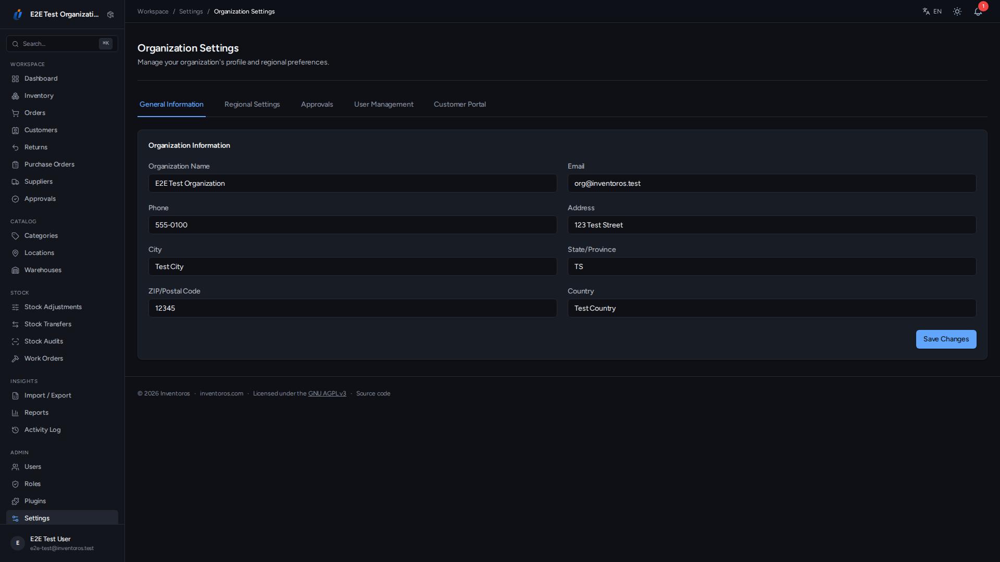 |

</details>

### Light Mode

| Dashboard | Products | Orders |
|-----------|----------|--------|
| 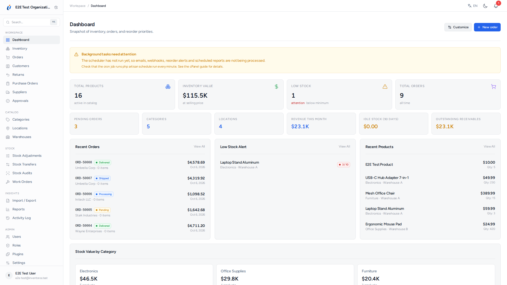 | 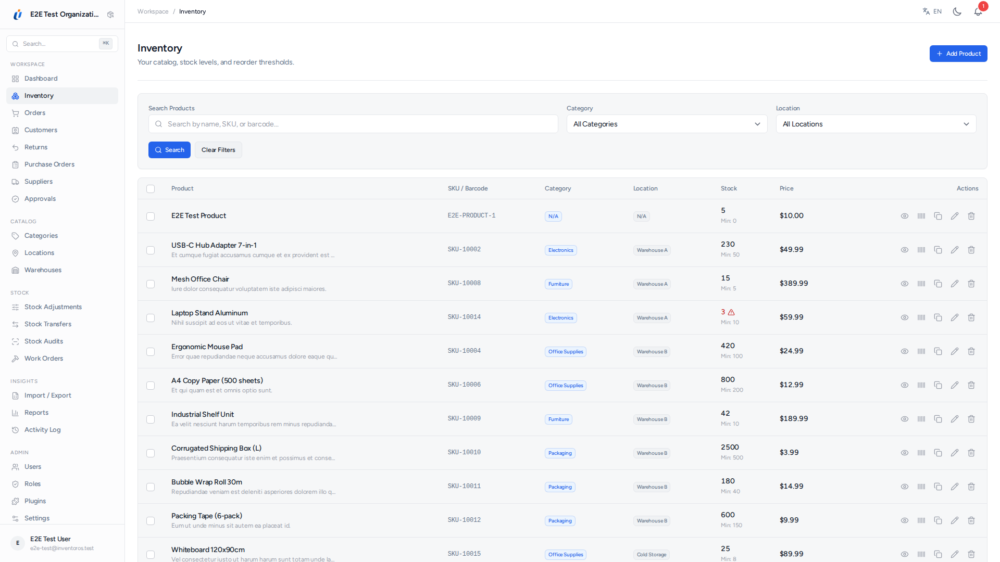 | 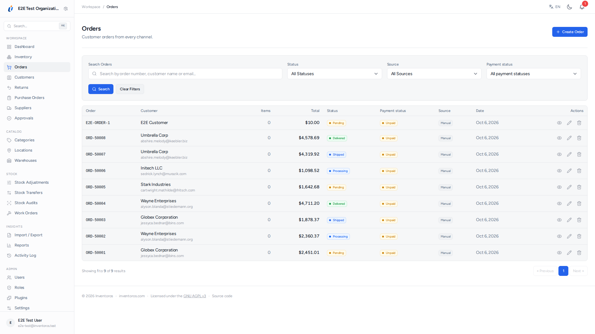 |

| Reports | Locations | Purchase Orders |
|---------|-----------|-----------------|
| 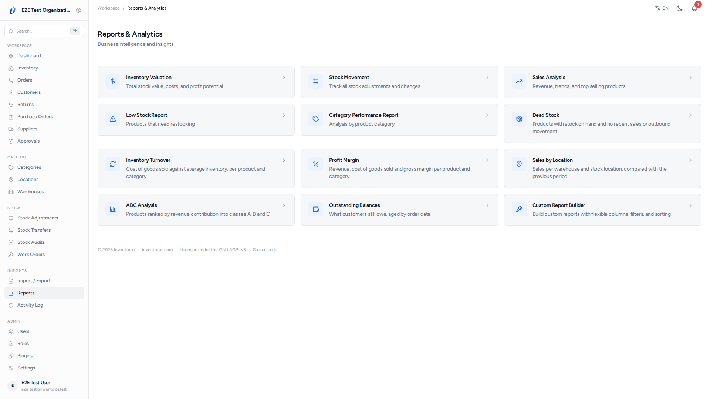 | 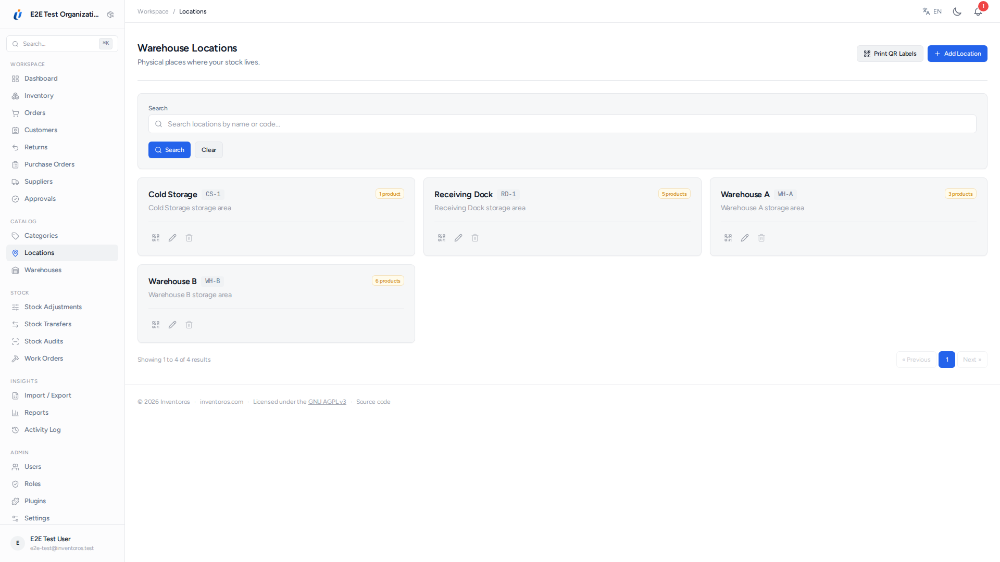 | 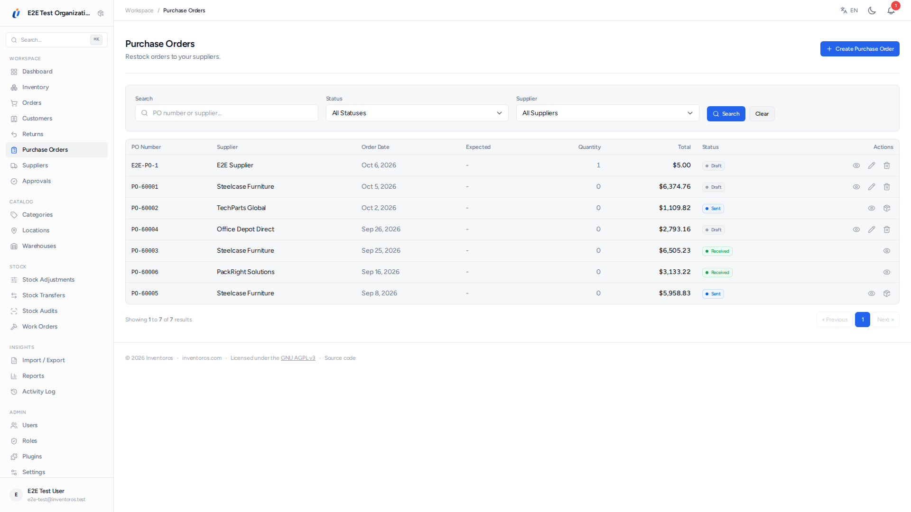 |

<details>
<summary>More light mode screenshots</summary>

| Categories | Suppliers | Settings |
|------------|-----------|----------|
| 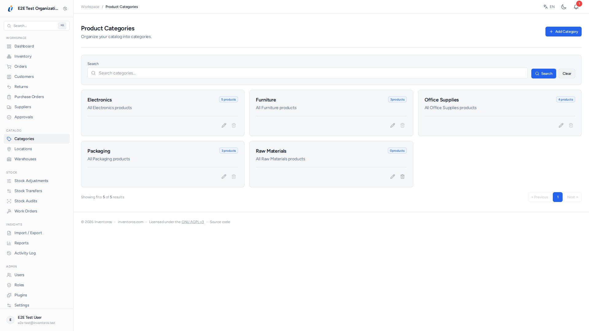 | 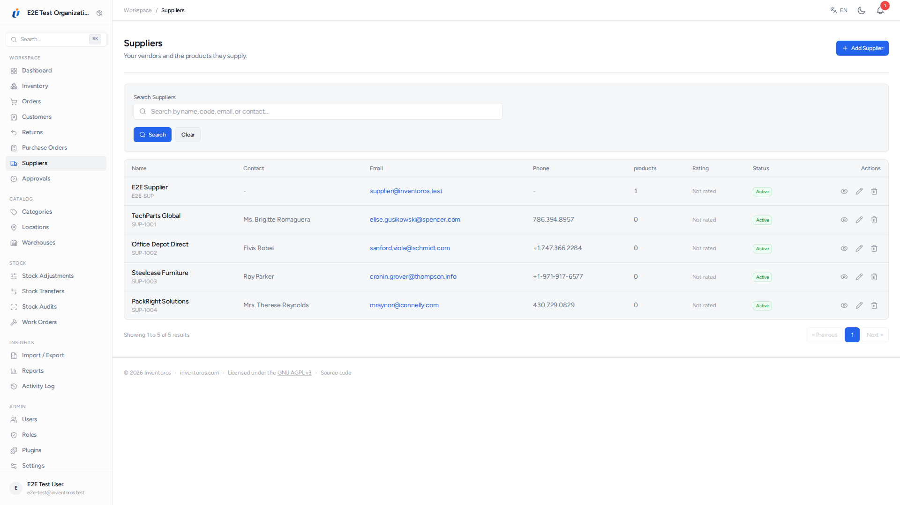 | 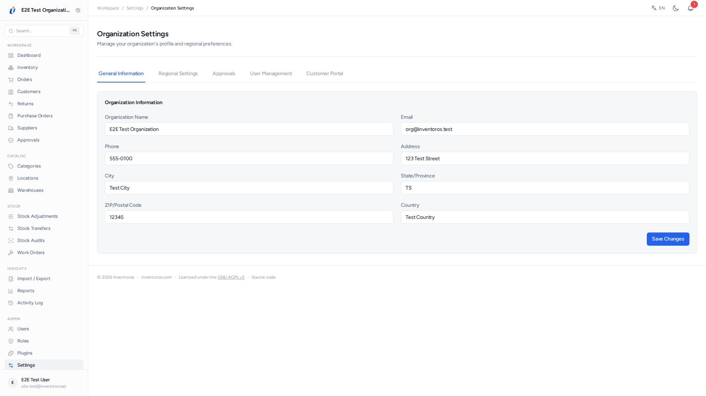 |

</details>

## Features

### Inventory & Product Management
- Full product CRUD with SKU, pricing, stock levels, categories, locations, and barcodes
- **Product variants** with options (size, color, material) and variant-specific SKUs, pricing, and stock
- **Kitting & bundling** -- create virtual kit products with auto-calculated stock from components
- **Assembly & work orders** -- production workflow that consumes components and produces finished goods
- **Batch tracking** with lot numbers, expiry dates, and manufacturing dates
- **Serial number tracking** with individual status management
- Barcodes in Code 128, EAN-13, UPC-A, EAN-8 and Code 39, QR codes for products and locations, bulk printing, and keyboard-wedge or camera scanning
- Configurable SKU patterns with auto-generation
- CSV import/export for products, orders and users, with row-by-row results
- Scheduled cycle counts and stock audits

### Multi-Warehouse Management
- **Multiple warehouses** with addresses, contacts, and per-warehouse settings
- **Warehouse-level user access control** -- restrict staff to specific warehouses
- **Global warehouse switcher** in the header to filter all views
- **Inter-warehouse stock transfers** with shipping method, tracking number, and transit status
- Default warehouse per organization with manual override on orders
- Per-warehouse reorder points, warehouse and location capacity, and fulfilment priority
- Locations nested within warehouses (Warehouse > Aisle > Shelf > Bin)

### Order & Supply Chain
- Full order lifecycle with automatic inventory adjustments and row locking
- Order approval workflow (pending, approved, rejected)
- **Line and order discounts, payments and refunds**, order payment status, and an accounts-receivable aging report
- **Invoices** with per-organization numbering, emailed to the customer as a PDF
- **Returns & exchanges (RMA)** -- full return lifecycle with automatic stock restoration
- Purchase orders emailed to suppliers with the PDF, item receiving, supplier price history and ratings
- Customer management with order history
- Automated reorder points with supplier-grouped PO generation

### Shipping & Fulfilment
- **Shipments** per order, including partial shipments; orders move to shipped and delivered as they go
- **EasyPost** rates, label purchase, tracking and voids, or manual shipments with your own tracking
- Tracking updates by webhook with a polling backstop, and an optional shipment email to the customer

### Customer Portal
- A B2B portal per organization at `/portal/{org-slug}` for invited customer contacts
- Customers see their orders, shipments, payments, balance and invoice PDFs, and request returns

### Approval Workflows
- Optional approval for purchase orders, manual stock adjustments and stock transfers, with thresholds
- A Pending approvals page with a sidebar count; all workflows are off by default

### Reports & Analytics
- Valuation, stock movement, sales analysis, low stock, dead stock, inventory turnover, profit margin, sales by location and ABC analysis
- **Custom report builder** over 6 data sources with columns, filters, sorting and shared templates
- Export any report to CSV, Excel or PDF, and email saved reports on a daily, weekly or monthly schedule

### User & Access Management
- Role-based access control with 30+ granular permissions
- Custom roles with reusable permission set templates
- Two-factor authentication (TOTP with setup wizard, QR code, and recovery codes)
- API token management (create, list, revoke)

### REST & GraphQL APIs
- **REST API v1** covering products, orders, payments, shipments, approvals, customers, returns, transfers, users and more
- **GraphQL API** with queries and mutations, permission checks, and query depth/complexity limits
- **MCP server** at `/mcp` so AI clients can read and act on inventory with a user's token ([docs/mcp/README.md](docs/mcp/README.md))
- OpenAPI spec in [docs/api/openapi.yaml](docs/api/openapi.yaml), also served by a running install at `/docs/api`
- Sanctum token authentication with scoped abilities

### Plugin System
- WordPress-style hooks and filters
- Runtime plugin UI: pages, dashboard widgets, menu items and tabs, loaded without rebuilding the app
- **Plugin marketplace**: install and update signed plugins from inventoros.com
- Sample plugin with documentation

### Notifications & Integrations
- Email notifications with multi-provider support (SMTP, Mailgun, SendGrid)
- Customizable templates with per-user preferences
- Webhook system with HMAC-SHA256 signing, exponential backoff retry, and delivery logs

### System & DevOps
- Multi-tenant architecture with organization-based data isolation
- Installer wizard with database validation and admin creation
- Update manager with automatic backups (UI + CLI)
- Activity logging with filtering and export
- Dark mode with persistent preferences
- Global search command palette (Ctrl+K / Cmd+K)
- Automated screenshot generation via GitHub Actions
- 1000+ tests with comprehensive coverage

## Technology Stack

| Layer | Technology |
|-------|-----------|
| Backend | Laravel 13 (PHP 8.4) |
| Frontend | Inertia.js v3 + Vue 3 + Tailwind CSS |
| Build | Vite 7 |
| Database | SQLite (dev) / MySQL 8+ / PostgreSQL 13+ |
| API | REST + GraphQL (Sanctum auth) |
| Testing | PHPUnit + Playwright |
| Architecture | Multi-tenant, plugin-ready |

## Requirements

- PHP 8.4 (8.4.1 or newer; PHP 8.5 is not supported yet)
- Composer 2.x
- Node.js 20.19+ or 22.12+ and npm (Vite 7)
- MySQL 8.0+ or PostgreSQL 13+ (SQLite for development)
- Redis (optional, recommended for production queues)

## Installation

### Quick Start

```bash
git clone https://github.com/Inventoros/Inventoros.git
cd Inventoros

composer install
cp .env.example .env
php artisan key:generate

php artisan migrate
npm install && npm run build

php artisan serve
```

### Development Setup

```bash
# Run all dev services (server, queue, logs, vite) concurrently
composer dev

# Or run individually
php artisan serve       # Application server
npm run dev             # Vite dev server with HMR
php artisan queue:work  # Queue worker
```

## Configuration

1. Copy `.env.example` to `.env` and configure:
   - Database credentials (`DB_*`)
   - Application URL (`APP_URL`)
   - Mail settings (for notifications)
   - Queue driver (recommend `redis` for production)

2. Run `php artisan migrate` to create the database schema

3. Run `npm run build` for production assets

4. Run the scheduler (`* * * * * php artisan schedule:run` in cron) and a queue worker (`php artisan queue:work`). Scheduled reports, cycle counts, shipment tracking, emails and webhooks depend on them. See the [cPanel](docs/site/sections/installation-cpanel.md) and [VPS](docs/site/sections/installation-vps.md) guides.

## Testing

```bash
# Run all tests
composer test

# Run specific suites
php artisan test --testsuite=Feature
php artisan test --testsuite=Unit

# Run E2E tests
npm run test:e2e
```

## CLI Commands

```bash
php artisan app:update --check        # Check for updates
php artisan app:update                # Perform update with backup
php artisan app:update --backup       # Create manual backup
php artisan app:update --list-backups # List backups
php artisan app:update --restore=file # Restore from backup
```

## API

The REST API is available at `/api/v1/` with Sanctum token authentication.

<details>
<summary>View all API endpoints</summary>

| Resource | Endpoints |
|----------|-----------|
| Products | `GET`, `POST`, `GET/{id}`, `PUT/{id}`, `DELETE/{id}` |
| Product Options | Nested under products: `GET`, `POST`, `PUT/{id}`, `DELETE/{id}` |
| Product Variants | Nested under products: `GET`, `POST`, `PUT/{id}`, `DELETE/{id}`, `POST/adjust-stock` |
| Product Components | Nested under products: `GET`, `POST`, `PUT/{id}`, `DELETE/{id}` |
| Batch Tracking | Nested under products: `GET`, `POST`, `GET/{id}` |
| Serial Tracking | Nested under products: `GET`, `POST`, `GET/{id}`, `PUT/{id}` |
| Categories | `GET`, `POST`, `GET/{id}`, `PUT/{id}`, `DELETE/{id}` |
| Locations | `GET`, `POST`, `GET/{id}`, `PUT/{id}`, `DELETE/{id}` |
| Warehouses | `GET`, `POST`, `GET/{id}`, `PUT/{id}`, `DELETE/{id}` |
| Orders | `GET`, `POST`, `GET/{id}`, `PUT/{id}`, `DELETE/{id}`, `POST/approve`, `POST/reject`, `POST/invoice/email` |
| Order Payments | Nested under orders: `GET/payments`, `POST/payments`, `POST/refunds`, `POST/payments/{id}/void` |
| Shipments | `GET`, `GET/{id}`, nested under orders: `GET`, `POST`; `POST/rates`, `POST/buy-label`, `POST/void-label`, `POST/ship` |
| Approvals | `GET`, `GET/mine`, `POST/{type}/{id}/approve`, `POST/{type}/{id}/reject` |
| Customers | `GET`, `POST`, `GET/{id}`, `PUT/{id}`, `DELETE/{id}`, `GET/{id}/orders` |
| Returns (RMA) | `GET`, `POST`, `GET/{id}`, `PATCH/{id}/items`, `POST/approve`, `POST/receive`, `POST/complete`, `POST/reject` |
| Stock Transfers | `GET`, `POST`, `GET/{id}`, `POST/ship`, `POST/complete`, `POST/cancel` |
| Stock Adjustments | `GET`, `POST`, `GET/{id}` |
| Stock Audits | `GET`, `POST`, `GET/{id}`, `POST/start`, `POST/items/{item}/count`, `POST/complete` |
| Suppliers | `GET`, `POST`, `GET/{id}`, `PUT/{id}`, `DELETE/{id}` |
| Purchase Orders | `GET`, `POST`, `GET/{id}`, `PUT/{id}`, `DELETE/{id}`, `POST/receive`, `POST/send`, `POST/cancel`, `POST/submit-for-approval` |
| Work Orders | `GET`, `POST`, `GET/{id}`, `DELETE/{id}`, `POST/start`, `POST/complete`, `POST/cancel` |
| Webhooks | `GET`, `POST`, `GET/{id}`, `PUT/{id}`, `DELETE/{id}`, `POST/regenerate-secret`, `GET/deliveries` |
| Users | `GET`, `POST`, `GET/{id}`, `PUT/{id}` |
| Saved Reports | `GET`, `POST`, `GET/{id}`, `PUT/{id}`, `DELETE/{id}`, `GET/{id}/export` |
| Permission Sets | `GET`, `POST`, `GET/{id}`, `PUT/{id}`, `DELETE/{id}`, `GET/categories` |
| Barcode Lookup | `GET/{code}` |

</details>

The **GraphQL API** is available at `/graphql` with Sanctum bearer token authentication. The [API guide](docs/api/README.md) covers authentication, permissions, webhooks and GraphQL, and [docs/api/openapi.yaml](docs/api/openapi.yaml) is the full spec. A running install also serves an interactive reference at `/docs/api` on its own domain; outside `local` it requires a signed-in user unless `API_DOCS_PUBLIC=true`. Guides are also published at [inventoros.com/docs](https://inventoros.com/docs).

## Documentation

- [Upgrade Guide](UPGRADE.md) -- Upgrading from v1.0.x to v2.0.0
- [Changelog](CHANGELOG.md) -- What changed in each release
- [cPanel Deployment](CPANEL.md) -- Deploy on shared hosting
- [Plugin Development](docs/PLUGIN_DEVELOPMENT.md) -- Creating plugins with hooks and filters
- [Email Notifications](docs/features/email-notifications.md) -- Configuration and usage
- [Barcode Scanning](docs/features/barcode-scanning.md) -- Camera-based scanning integration
- [API Guide](docs/api/README.md) -- REST, GraphQL and webhooks ([OpenAPI spec](docs/api/openapi.yaml); a running install serves it at `/docs/api`)
- [MCP Server](docs/mcp/README.md) -- Connecting AI clients

## Contributing

We welcome contributions! Please see [CONTRIBUTING.md](CONTRIBUTING.md) for guidelines.

- Follow [PSR-12](https://www.php-fig.org/psr/psr-12/) coding standards
- Use `declare(strict_types=1)` in all PHP files
- Write tests for new features
- Use conventional commit messages

## Community & Support

- [GitHub Issues](https://github.com/Inventoros/Inventoros/issues) -- Bug reports and feature requests
- [GitHub Discussions](https://github.com/Inventoros/Inventoros/discussions) -- Questions and ideas
- [Security Policy](SECURITY.md) -- Reporting vulnerabilities

## License

Copyright (c) 2025-2026 Inventoros ([inventoros.com](https://inventoros.com)).

Inventoros is free, open-source software licensed under the [GNU Affero General Public License v3.0](LICENSE) (AGPL-3.0-only). If you run a modified version of Inventoros as a network service, the AGPL requires you to offer your users the source code of that modified version.

Releases up to and including v1.0.8 were published under the MIT license and remain available under those terms.

## Acknowledgments

Built with [Laravel](https://laravel.com), [Inertia.js](https://inertiajs.com), [Vue.js](https://vuejs.org), and [Tailwind CSS](https://tailwindcss.com).
